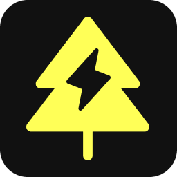

<p align="center">
  
</p>

<h1 align="center">Vegeo Web App</h1>

<p align="center">
  
  
  
</p>

## Motivation

This repository provides a small web app to showcase geo-referenced vegetation alerts. It let's you pick one of 29 major US cities, displays open source satellite imagery from the [USDA National Agriculture Imagery Program](https://www.arcgis.com/home/item.html?id=e74cf6b0790e424489bbe84cbc0dc7ad) (NAIP) in a map view and overlays low-voltage power lines of the chosen city from [OpenStreetMap](https://wiki.openstreetmap.org/wiki/Tag:power%3Dminor_line). When zooming in, you will see detected vegetation highlighted in magenta, along with alert markers where vegetation overlaps with power lines. Clicking on a marker will provide additional details, such as the estimated risk level.

The web app works in conjunction with the [`vegeo-backend`](https://github.com/klaasnotfound/vegeo-backend) API server which should be running at `localhost:8000`.


## Installation

First, clone the repository:

```bash
git clone git@github.com:klaasnotfound/vegeo-web-app.git
cd vegeo-web-app
```

If you use Docker, simply type:

```bash
docker compose up
```

Alternatively, if you have `node` and `npm` installed, you can use:

```
npm i
npm run build && npm start
```

That's it. You should now be able to access the web app at [localhost:3000](http://localhost:3000).
